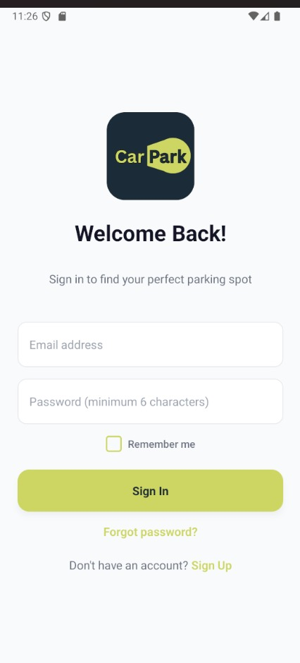
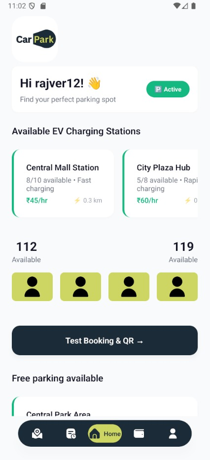
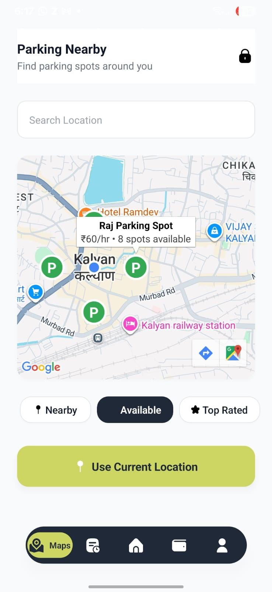
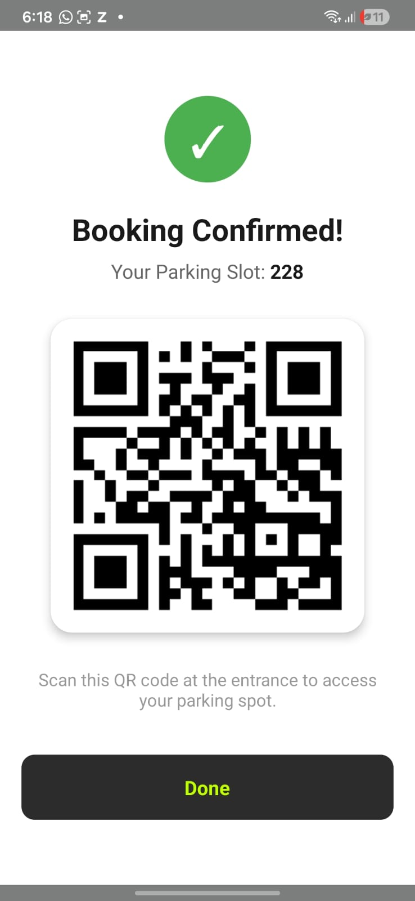
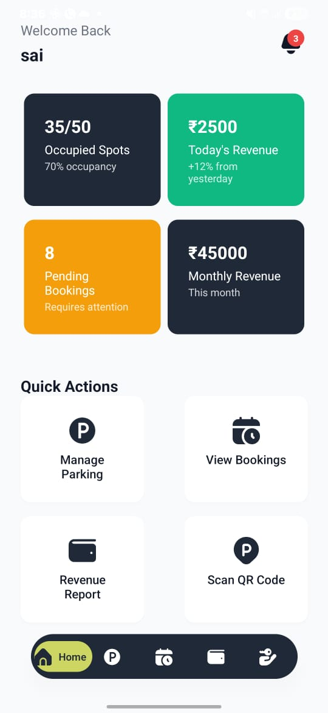
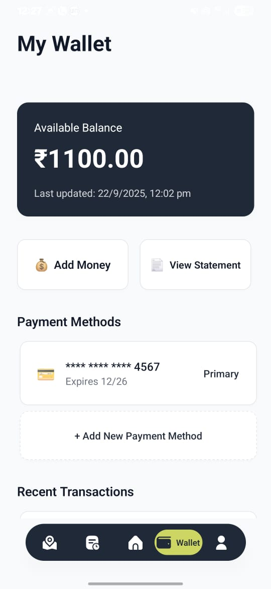

# CarPark – Smart Parking Management Mobile Application

CarPark is a smart parking management mobile application built using **React Native and Node.js**.  
It helps users find available parking slots nearby, book them instantly, and manage payments digitally.

---

## App Screenshots

<table>
<tr>
<td></td>
<td></td>
<td></td>
</tr>

<tr>
<td></td>
<td></td>
<td></td>
</tr>
</table>

---

## Features

- 🔍 Search available parking slots within **5 km radius**
- 📍 Real-time parking availability
- 📲 **QR code based slot booking**
- 💳 Digital wallet for parking payments
- 🧾 Instant booking receipt
- 🗺️ User-friendly navigation and booking interface

---

## Tech Stack

**Frontend**
- React Native CLI
- TypeScript

**Backend**
- Node.js
- REST APIs

**Tools & Services**
- Firebase
- QR Code Scanner
- Git & GitHub
- Google Maps API key
---

## How It Works

1. User searches for parking spaces nearby.
2. Available parking slots are displayed in the app.
3. User selects a parking location.
4. Booking is confirmed using **QR code scanning**.
5. Payment is made using the **in-app wallet**.
6. User receives a **digital receipt** for the booking.

---

## Installation

Clone the repository:

```bash
git clone https://github.com/Sunn-y103/CarPark.git
